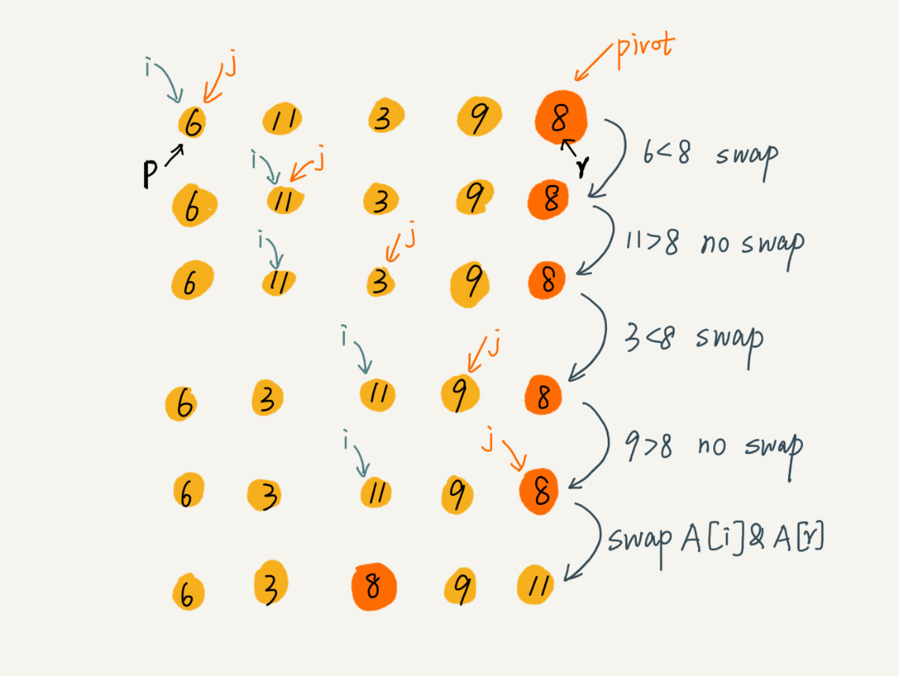

# 排序和查找入门

# 排序

## 1.排序的好坏需要比较的参数

### 	1.时间复杂度

### 	2.比较和交换的次数

​		1.是否是原地排序

​		2.是否稳定

## 2.常见经典排序(按照时间复杂度划分)

### 	1.O(n2)

​		1.冒泡(稳定,原地)只比较相邻,第一遍会将最大的排到末尾

​		2.插入(稳定,原地)划分已排序和未排序区间,未排序的第一个插入已排序中

​		3.选择(不稳定,原地)在未排序区间选择最小的放到已排序末尾(方式是交换,所以不稳定)

​		插入更受欢迎,因为冒泡要频繁的交换元素,插入则少一点

### 2.O(nlogn)

#### 	1.归并排序(不原地,稳定)


```
递推公式：
merge_sort(p…r) = merge(merge_sort(p…q), merge_sort(q+1…r))
//q=(p+r)/2中间位置
终止条件：
p >= r 不用再继续分解
```

##### 分解合并步骤

1.先分解到最小单元,再进行单独排序

2.合并过程中需要申请一个新数组,再通过两个指针i,j标记两个小叔组的元素

3.比较i,j下标的数组,将小的放到新数组里然后移动标记


```java
public class MergeSort {

  // 归并排序算法, a是数组，n表示数组大小
  public static void mergeSort(int[] a, int n) {
    mergeSortInternally(a, 0, n-1);
  }

  // 递归调用函数
  private static void mergeSortInternally(int[] a, int p, int r) {
    // 递归终止条件
    if (p >= r) return;

    // 取p到r之间的中间位置q,防止（p+r）的和超过int类型最大值
    int q = p + (r - p)/2;
    // 将标记前后的数组分治递归,进行排序
    mergeSortInternally(a, p, q);
    mergeSortInternally(a, q+1, r);

    // 将A[p...q]和A[q+1...r]合并为A[p...r]
    merge(a, p, q, r);
  }

  private static void merge(int[] a, int p, int q, int r) {
    int i = p;
    int j = q+1;
    int k = 0; // 初始化变量i, j, k
    int[] tmp = new int[r-p+1]; // 申请一个大小跟a[p...r]一样的临时数组
    while (i<=q && j<=r) {
      if (a[i] <= a[j]) {
        tmp[k++] = a[i++]; // i++等于i:=i+1
      } else {
        tmp[k++] = a[j++];
      }
    }

    // 判断哪个子数组中有剩余的数据
    int start = i;
    int end = q;
    if (j <= r) {
      start = j;
      end = r;
    }

    // 将剩余的数据拷贝到临时数组tmp
    while (start <= end) {
      tmp[k++] = a[start++];
    }

    // 将tmp中的数组拷贝回a[p...r]
    for (i = 0; i <= r-p; ++i) {
      a[p+i] = tmp[i];
    }
  }

}
```


#### 	2.快速排序(原地,不稳定)


```
递推公式：
quick_sort(p…r) = quick_sort(p…q-1) + quick_sort(q+1, r)

终止条件：
p >= r
```

##### 快排步骤

1.任意取数组中的一个元素(一般选取最后一个)作为标记pivot

2.遍历数组.将数组根据标记的大小分成两部分,分别放在标记的左右

3.再从标记的左右数组中重复1.2步骤,进行排序,直到区间缩小为1

##### 关于原地分区

小分区排序借助选择排序的思想

先定义i,j,pivot三个用于标记




```java
public class QuickSort {

  // 快速排序，a是数组，n表示数组的大小
  public static void quickSort(int[] a, int n) {
    quickSortInternally(a, 0, n-1);
  }

  // 快速排序递归函数，p,r为下标
  private static void quickSortInternally(int[] a, int p, int r) {
    if (p >= r) return;

    int q = partition(a, p, r); // 获取分区点
    quickSortInternally(a, p, q-1);//将标记之前的数组排序
    quickSortInternally(a, q+1, r);//这是之后的,运用递归
  }

  private static int partition(int[] a, int p, int r) {
    int pivot = a[r];//取队尾元素
    int i = p;//队首下标
    for(int j = p; j < r; ++j) {
        //在p,r区间循环
      if (a[j] < pivot) {
          //循环结果小于标记,和队首元素交换,并且i+1,使得下次循环交换i的下一个,
          //而且i之前的区间就都比pivot小了
        int tmp = a[i];
        a[i] = a[j];
        a[j] = tmp;
        ++i;
      }
    }
	//然后将标记位和i的元素交换,这样的分区就pivot左边比他小,右边比他大
    int tmp = a[i];
    a[i] = a[r];
    a[r] = tmp;

    System.out.println("i=" + i);
    return i;
  }
}
```


### 3.O(n)

#### 1.桶排序


# 查找

## 二分查找

### 数组思想

查找速度O(logn)

使用条件,数据需要存放在数组中,且排好序

#### 非递归实现

```java
	/**
     * 二分查找普通实现。
     * @param srcArray 有序数组
     * @param key 查找元素
     * @return  不存在返回-1
     */
    public static int binSearch(int srcArray[], int key) {
        int mid;
        int start = 0;
        int end = srcArray.length - 1;
        while (start <= end) {
            mid = (end - start) / 2 + start;
            if (key < srcArray[mid]) {
                end = mid - 1;
            } else if (key > srcArray[mid]) {
                start = mid + 1;
            } else {
                return mid;
            }
        }
        return -1;
    }

```

#### 递归实现

```java
	/**
     * 二分查找递归实现。
     * @param srcArray  有序数组
     * @param start 数组低地址下标
     * @param end   数组高地址下标
     * @param key  查找元素
     * @return 查找元素不存在返回-1
     */
    public static int binSearch(int srcArray[], int start, int end, int key) {
        int mid = (end - start) / 2 + start;
        if (srcArray[mid] == key) {
            return mid;
        }
        if (start >= end) {
            return -1;
        } else if (key > srcArray[mid]) {
            return binSearch(srcArray, mid + 1, end, key);
        } else if (key < srcArray[mid]) {
            return binSearch(srcArray, start, mid - 1, key);
        }
        return -1;
    }

```

### 链表思想

#### 跳表

跳表是通过链表来实现二分查找的思想

通过建立索引,查找的时间复杂度也是O(logn)